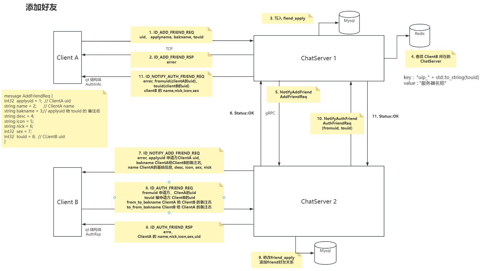
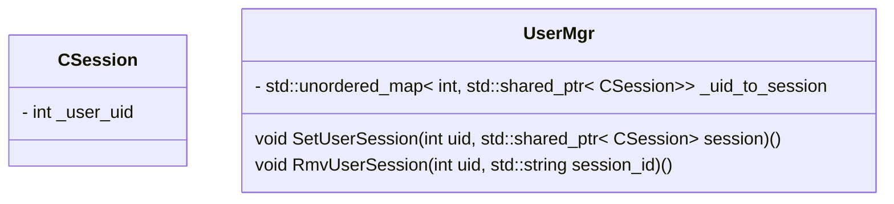
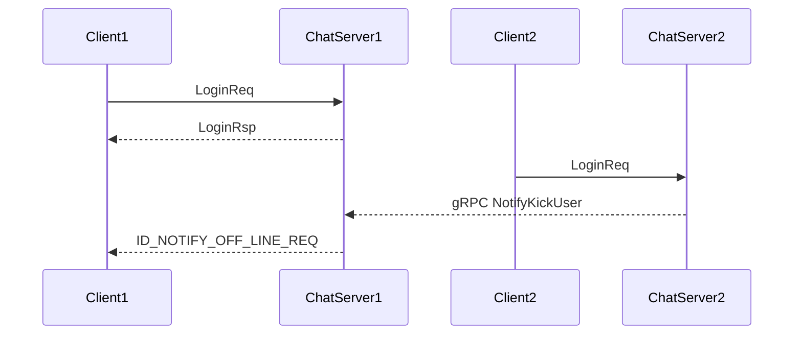

<!--
 * @Author: star-cs
 * @Date: 2025-06-08 19:05:08
 * @LastEditTime: 2025-06-28 21:40:27
 * @FilePath: /CChat_server/README.md
 * @Description: 
-->
# 🚀 CChat_server

[](LICENSE)
[](https://github.com/star-cs/CChat_server/stargazers)
[](https://github.com/star-cs/CChat_server/issues)
[]()

> 📖 **CChat_server** 是一款面向企业和团队的 **协同办公软件后端服务端**，支持 **即时聊天、个人网盘、视频会议** 等功能，基于 CMake 开发及部署。

```bash
sudo apt-get install libmysqlcppconn-dev

sudo apt-get install libboost-dev libboost-test-dev libboost-all-dev
```


# 业务逻辑分析
## 登录注册


## 好友申请



## 分布式锁
在分布式系统中，当多个进程 / 服务需要互斥地访问共享资源时，提供一种协调机制，确保同一时间只有一个进程能持有锁并执行操作。


Redis 基于内存操作，单命令执行速度极快，非常适合锁这种需要快速获取和释放的场景。
Redis 提供了强大的原子操作（如 `SET key value NX PX milliseconds` ），这是构建安全分布式锁的基础。

1. 获取锁 (Lock Acquisition):  
- 核心命令： `SET lock_key unique_value NX PX expire_time`  
    - lock_key: 代表要锁定的资源或操作的唯一标识符（如 order_lock:12345, inventory_lock:item_xyz）。
    - unique_value: 全局唯一标识符（如 UUID、进程ID+时间戳+随机数）。这是防止误删锁的关键！ 必须是当前尝试获取锁的客户端生成的唯一值。
    - NX: 只有键 lock_key 不存在时才设置值（即获取锁）。如果键已存在（锁被其他客户端持有），则设置失败，返回 nil。
    - PX expire_time: 设置键的过期时间（毫秒）。这是防止死锁的核心！ 即使持有锁的客户端崩溃，锁也会在 expire_time 后自动释放，避免系统永久挂起。

2. 释放锁 (Lock Release):  
只能由锁的持有者释放锁。 使用 Lua 脚本保证操作的原子性。
    ```lua
    if redis.call("get", KEYS[1]) == ARGV[1] then
        return redis.call("del", KEYS[1])
    else
        return 0
    end
    ```
    - KEYS[1]: 锁的键名 (lock_key)
    - ARGV[1]: 锁持有者创建的唯一值 (unique_value)


3. 锁续期 (Lock Renewal / Watchdog):  （`没用到`）  
问题： 如果业务操作执行时间超过了锁的初始过期时间 (expire_time)，锁会自动失效，其他客户端可能获得锁并操作共享资源，导致并发问题。  
解决方案： 在持有锁期间，由客户端启动一个后台线程（看门狗线程），定期（例如在过期时间的 1/3 时）检查锁是否仍由自己持有（检查 lock_key 的值是否是自己的 unique_value），如果是，则续期锁（使用 PEXPIRE 命令重置过期时间）。


## 踢人操作
### 单服务器
情况分析：  
1. B新登录，此时A已登录；B通过uid找到A的 session 发送踢人通知。 
2. B新登录，此时A即将下线；这种需要保证 B 和 A 的互斥，要么B先登录A再下线；要么A先下线B再登录 ~   

    2.1. B 先登录，会将 uid 对应的session更新为最新的。A下线的时候查找uid对应的session，发送不是自己的，则直接退出即可，不需要修改uid对应的session  
    2.2. A 先退出，A下线会优先查找uid对应的session，发送uid对应的session和自己连接一致，则将uid对的session置空，然后B登录将uid对应的session设置为新连接。


3. B登录，A退出，此时 C 查找uid发送消息，三个操作都会添加分布式锁。谁竞争到锁，谁操作。  



- UserMgr 通过uid，找到对应的 CSession 会话连接
- CSession 保存 uid，用于比对 所绑定 客户端  

#### 1. 登录 添加 分布式锁
我们需要对登录流程添加分布式锁，收到登录请求会做如下事情
1. 判断token和uid是否合理
2. 根据uid构造分布式锁key，然后实现分布式锁加锁操作。比如uid为1001，则分布式锁的key为"lock_1001"
3. 加锁后通过defer自动析构解锁
4. 通过uid获取用户之前登录的服务器，如果存在则说明uid对应的用户还在线，此时要做踢人，判断serverip和现在的服务器ip是否相等，如果相等则说明是  
    - 本服务器踢人，只需要通过线程锁控制好并发逻辑即可，将uid对应的旧session发送信息通知客户端下线，并且将旧session从server中移除。  
    - 如果不是本服务器，则要做跨服踢人，调用grpc踢人即可，留作之后做。
5. 登录成功后，要将uid和对应的ip信息写入redis,方便以后跨服查找。另外uid对应的session信息也要写入redis， 同时将uid和session关联，这样可以通过uid快速找到session

#### 2. 检测离线处理
服务器也会检测到离线也会清理连接，但是要注意，连接可以不按照分布式锁加锁清理，但是连接的信息要加分布式锁后再更新。    
在发送和接收的时候都可能检测到对方离线而报错，所以在AsyncReadBody和AsyncReadHead以及AsyncWrite等错误处理的时候记得加上连接清理操作。（主动移除CSession）

### 跨服务器

