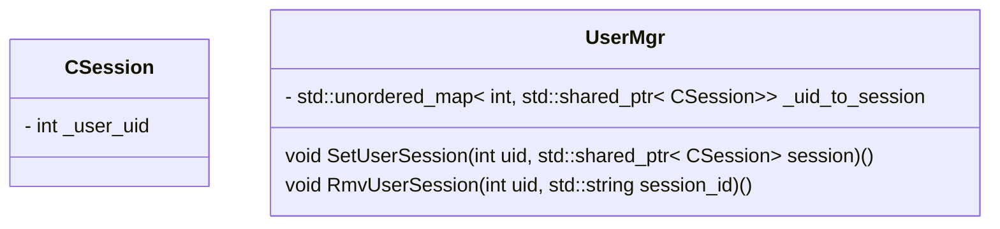
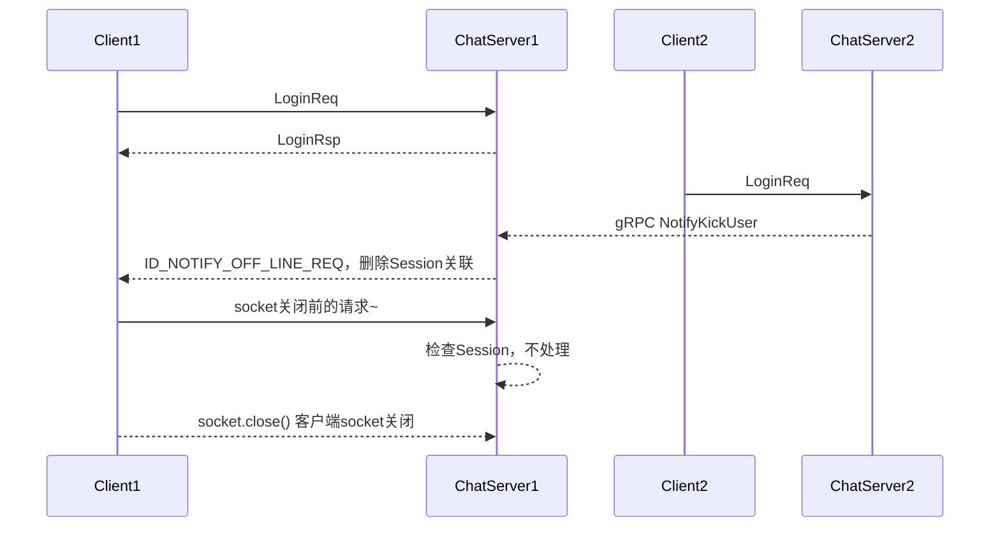
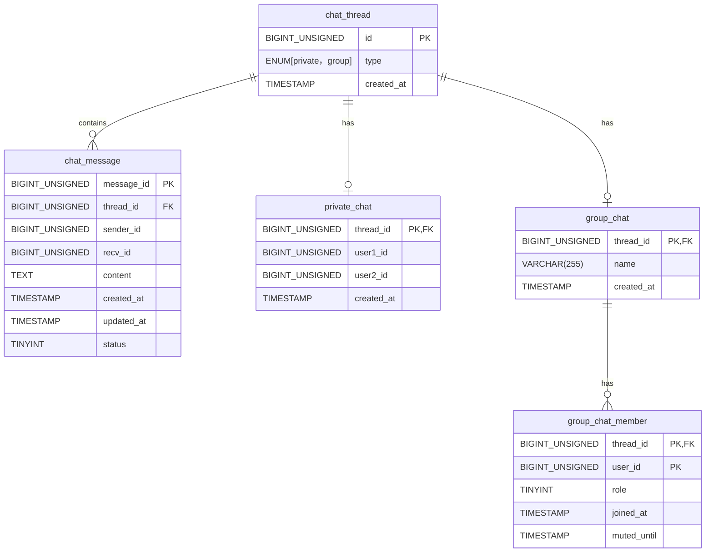

<!--
 * @Author: star-cs
 * @Date: 2025-06-08 19:05:08
 * @LastEditTime: 2025-07-07 19:45:07
 * @FilePath: /CChat_server/README.md
 * @Description: 
-->
# 🚀 CChat_server

[](LICENSE)
[](https://github.com/star-cs/CChat_server/stargazers)
[](https://github.com/star-cs/CChat_server/issues)
[]()

> 📖 **CChat_server** 是一款面向企业和团队的 **协同办公软件后端服务端**，支持 **即时聊天、个人网盘、视频会议** 等功能，基于 CMake 开发及部署。

[协同办公软件 QT前端仓库](https://github.com/star-cs/CChat_client)


```bash
sudo apt-get install libmysqlcppconn-dev

sudo apt-get install libboost-dev libboost-test-dev libboost-all-dev

# 检查 mysql 状态
systemctl status mysql.service
systemctl restart mysql
```

# 业务逻辑分析
## 登录注册


## 好友申请


## 分布式锁
在分布式系统中，当多个进程 / 服务需要互斥地访问共享资源时，提供一种协调机制，确保同一时间只有一个进程能持有锁并执行操作。


Redis 基于内存操作，单命令执行速度极快，非常适合锁这种需要快速获取和释放的场景。
Redis 提供了强大的原子操作（如 `SET key value NX PX milliseconds` ），这是构建安全分布式锁的基础。

1. 获取锁 (Lock Acquisition):  
- 核心命令： `SET lock_key unique_value NX PX expire_time`  
    - lock_key: 代表要锁定的资源或操作的唯一标识符（如 order_lock:12345, inventory_lock:item_xyz）。
    - unique_value: 全局唯一标识符（如 UUID、进程ID+时间戳+随机数）。这是防止误删锁的关键！ 必须是当前尝试获取锁的客户端生成的唯一值。
    - NX: 只有键 lock_key 不存在时才设置值（即获取锁）。如果键已存在（锁被其他客户端持有），则设置失败，返回 nil。
    - PX expire_time: 设置键的过期时间（毫秒）。这是防止死锁的核心！ 即使持有锁的客户端崩溃，锁也会在 expire_time 后自动释放，避免系统永久挂起。

2. 释放锁 (Lock Release):  
只能由锁的持有者释放锁。 使用 Lua 脚本保证操作的原子性。
    ```lua
    if redis.call("get", KEYS[1]) == ARGV[1] then
        return redis.call("del", KEYS[1])
    else
        return 0
    end
    ```
    - KEYS[1]: 锁的键名 (lock_key)
    - ARGV[1]: 锁持有者创建的唯一值 (unique_value)


3. 锁续期 (Lock Renewal / Watchdog):  （`没用到`）  
问题： 如果业务操作执行时间超过了锁的初始过期时间 (expire_time)，锁会自动失效，其他客户端可能获得锁并操作共享资源，导致并发问题。  
解决方案： 在持有锁期间，由客户端启动一个后台线程（看门狗线程），定期（例如在过期时间的 1/3 时）检查锁是否仍由自己持有（检查 lock_key 的值是否是自己的 unique_value），如果是，则续期锁（使用 PEXPIRE 命令重置过期时间）。


## 踢人操作
### 单服务器
情况分析：  
1. B新登录，此时A已登录；B通过uid找到A的 session 发送踢人通知。 
2. B新登录，此时A即将下线；这种需要保证 B 和 A 的互斥，要么B先登录A再下线；要么A先下线B再登录 ~   

    2.1. B 先登录，会将 uid 对应的session更新为最新的。A下线的时候查找uid对应的session，发送不是自己的，则直接退出即可，不需要修改uid对应的session  
    2.2. A 先退出，A下线会优先查找uid对应的session，发送uid对应的session和自己连接一致，则将uid对的session置空，然后B登录将uid对应的session设置为新连接。


3. B登录，A退出，此时 C 查找uid发送消息，三个操作都会添加分布式锁。谁竞争到锁，谁操作。  



- UserMgr 通过uid，找到对应的 CSession 会话连接
- CSession 保存 uid，用于比对 所绑定 客户端  

#### 1. 登录 添加 分布式锁
我们需要对登录流程添加分布式锁，收到登录请求会做如下事情
1. 判断token和uid是否合理
2. 根据uid构造分布式锁key，然后实现分布式锁加锁操作。比如uid为1001，则分布式锁的key为"lock_1001"
3. 加锁后通过defer自动析构解锁
4. 通过uid获取用户之前登录的服务器，如果存在则说明uid对应的用户还在线，此时要做踢人，判断serverip和现在的服务器ip是否相等，如果相等则说明是  
    - 本服务器踢人，只需要通过线程锁控制好并发逻辑即可，将uid对应的旧session发送信息通知客户端下线，并且将旧session从server中移除。  
    - 如果不是本服务器，则要做跨服踢人，调用grpc踢人即可，留作之后做。
5. 登录成功后，要将uid和对应的ip信息写入redis,方便以后跨服查找。另外uid对应的session信息也要写入redis， 同时将uid和session关联，这样可以通过uid快速找到session

#### 2. 检测离线处理
服务器也会检测到离线也会清理连接，但是要注意，连接可以不按照分布式锁加锁清理，但是连接的信息要加分布式锁后再更新。    
在发送和接收的时候都可能检测到对方离线而报错，所以在AsyncReadBody和AsyncReadHead以及AsyncWrite等错误处理的时候记得加上连接清理操作。（主动移除CSession）

### 跨服务器
跨服踢人，和单服务器踢人本质差不多，只是增加一个 gRPC 的通知过程~




## 心跳机制

1. 每个CSession保存着最近的一次通信时间戳  
2. CServer启动一个定时器，每60秒，检查所有的CSession时间戳是否超过规定心跳时间

> 所以存在 CServer 查看 CSession 里的参数的操作。这两个分别是跑在不同的 io_context。需要线程锁；  
> 同时 需要分布式锁，对 LOGIN_COUNT 进行更新。

### 避免死锁
如果是两个线程锁，避免死锁的最简单方式就是同时加锁，或者顺序一致性加锁  
在 C++17 里，`std::scoped_lock`（也有人称它为“scope lock”）提供了对多个互斥量无死锁地一次性加锁的能力。它的核心在于内部调用了函数模板 std::lock(m1, m2, …)，该函数会：  
1. 尝试按某种顺序非阻塞地抓取所有 mutex：
    - std::lock 会循环地对每一个 mutex 做 try_lock()，
    - 如果有任何一个 try_lock() 失败，就立刻释放前面已经成功抓到的所有 mutex，退避（backoff），然后重试。
2. 保证最终所有 mutex 要么全部抓到了，要么都没抓到：  
    - 这样就避免了“线程 A 拿了 m1 等待 m2，而线程 B 拿了 m2 等待 m1”这种经典死锁情形。  

只要你的所有代码都用同一个调用 std::scoped_lock(m1, m2, …) 的方式去加这几把锁，就不会出现交叉锁导致的死锁。


### 分布式锁 ↔ 线程锁 互相嵌套死锁问题
1. 统一锁的获取顺序（分层锁）
    - 始终按同一个顺序去申请锁。
    - 比如：不论是业务 A（先分布式锁后线程锁）还是心跳（先线程锁后分布式锁），都改成 “先拿分布式锁 → 再拿线程锁” 或者 “先拿线程锁 → 再拿分布式锁” 之一即可。
    - 只要保证两个场景里锁的申请顺序一致，就不会互相等待导致死锁。

2. 使用带超时的尝试锁（tryLock）+ 重试／回退策略
    - 对于线程锁（例如 ReentrantLock）和分布式锁（例如 Redisson 的 tryLock(long waitTime, long leaseTime, TimeUnit unit)），都用 tryLock 而非阻塞式 lock()。
    - 如果某把锁在指定时间内拿不到，就释放已持有的那把锁，稍微退避（sleep 随机短时长）后重试。
    - 这样可以在检测到可能的死锁倾向时主动放弃，避免无限等待。

3. 合并锁或升级锁策略
    - 如果分布式节点上并发线程只是共享同一把“逻辑锁”，可以考虑把本地线程锁和分布式锁做一次封装：
    ```cpp
    class CombinedLock {
        RLock distLock;           
        std::mutex mtx;  
        public void lock() {
            distLock.lock();
            mtx.lock();
        }
        public void unlock() {
            mtx.unlock();
            distLock.unlock();
        }
    }
    ```
    > 伪代码里必须是 先上锁的后解锁 ~   
    - 这样业务层只用 combinedLock.lock()，根本不用关心哪把先后，底层永远是固定顺序。
### 优化连接数统计
当前每次 ChatServer 的CServer定时器会检测 心跳并更新Redis连接次数。
所以在 StatusServer 获取 ChatServer的时候，可以不用分布式锁。


## 锁的精度 / 连接池重连

### 锁的精度
- 粗粒度锁：保护大块数据或长时间持有 → 安全但并发性差
- 细粒度锁：保护最小必要数据/短时间持有 → 并发性好但易出错

1. 分解数据 + 独立锁。对每个临界区设置多个锁（分层锁）设置锁的顺序 ~ 

2. 减少临界区返回。`快速复制需要处理的数据，耗时操作在锁外执行 [常用]`

3. 使用读写锁（shared_mutex）
    ```cpp
    #include <shared_mutex>
    class ThreadSafeConfig {
        std::map<std::string, int> config;
        mutable std::shared_mutex rwMutex; // C++17

    public:
        int get(const std::string& key) const {
            // 读锁，共享锁（多读并行）
            std::shared_lock<std::shared_mutex> lk(rwMutex);
            return config.at(key);
        }

        void set(const std::string& key, int value) {
            // 写锁，独占锁（写互斥）
            std::unique_lock<std::shared_mutex> lk(rwMutex);
            config[key] = value;
        }
    };
    ```
4. 分片锁策略
    每个分片有自己的锁，而非整个数据结构公用一把锁~

5. 组合锁时避免死锁
    ```cpp
    // 同时获取多个锁（保证顺序）
    void transfer(Account& from, Account& to, double amt) {
        std::lock(from.mtx, to.mtx); // 同时锁定（避免死锁）
        std::lock_guard lk1(from.mtx, std::adopt_lock); // RAII接管
        std::lock_guard lk2(to.mtx, std::adopt_lock);

        from.balance -= amt;
        to.balance += amt;
    }
    ```

## 聊天信息存储方案

1. 客户端本地数据库缓存已经接受的消息(以后再做)  
2. 客户端登录后，将本地数据的最大的消息id发送给服务器，服务器根据这个id去数据库查找，找到比这个id大的消息，将消息回传给客户端  
3. 客户端登录后，先加载旧的数据，再差异加载未读取的数据即可。  

### 重点（数据模型设计）
> 消息 和 聊天会话 分离，通过 消息双方的uid 分别查询 ~ 
#### 聊天消息表
```sql
CREATE TABLE `chat_message` (
  `message_id` BIGINT UNSIGNED NOT NULL AUTO_INCREMENT,
  `thread_id`  BIGINT UNSIGNED NOT NULL,
  `sender_id`  BIGINT UNSIGNED NOT NULL,
  `recv_id`    BIGINT UNSIGNED NOT NULL,
  `content`    TEXT        NOT NULL,
  `created_at` TIMESTAMP   NOT NULL DEFAULT CURRENT_TIMESTAMP,
  `updated_at` TIMESTAMP   NOT NULL DEFAULT CURRENT_TIMESTAMP ON UPDATE CURRENT_TIMESTAMP,
  `status`     TINYINT     NOT NULL DEFAULT 0 COMMENT '0=未读 1=已读 2=撤回',
  PRIMARY KEY (`message_id`),
  KEY `idx_thread_created` (`thread_id`, `created_at`),
  KEY `idx_thread_message` (`thread_id`, `message_id`)
) ENGINE=InnoDB DEFAULT CHARSET=utf8mb4 COLLATE=utf8mb4_unicode_ci;
```
> - message_id：全局自增主键，唯一标识一条消息。
> - thread_id：会话（单聊、群聊）ID，同一会话下的所有消息共用一个 thread_id。
> - sender_id：发送者用户 ID，指向用户表的主键。
> - recv_id : 接收者用户ID，指向用户表主键。
> - content：消息正文，TEXT 类型，适合存储普通文字。
> - created_at：消息创建时间，自动记录插入时刻。
> - updated_at：消息更新时间，可用于标记“撤回”（status 变更）、编辑等操作。
> - status：消息状态，用于标记未读/已读/撤回等（也可扩展更多状态）。

1. 主键索引：PRIMARY KEY (message_id) 用于唯一检索消息。
2. 会话+时间索引：KEY (thread_id, created_at) 支持按会话分页、按时间范围查询。
3. 会话+消息ID 索引：KEY (thread_id, message_id) 支持按 message_id 做增量拉取（WHERE thread_id=… AND message_id > since_id）。

> 所有的消息都会通过 message_id 区分


#### 会话消息表
##### 全局聊天线程表
```sql
CREATE TABLE chat_thread (
  `id`          BIGINT UNSIGNED NOT NULL AUTO_INCREMENT,
  `type`        ENUM('private','group') NOT NULL,
  `created_at`  TIMESTAMP NOT NULL DEFAULT CURRENT_TIMESTAMP,
  PRIMARY KEY (id)
);
```


##### 单聊表设计
```sql
CREATE TABLE `private_chat` (
  `thread_id`   BIGINT UNSIGNED NOT NULL COMMENT '引用chat_thread.id',
  `user1_id`    BIGINT UNSIGNED NOT NULL,
  `user2_id`    BIGINT UNSIGNED NOT NULL,
  `created_at`  TIMESTAMP     NOT NULL DEFAULT CURRENT_TIMESTAMP,
  PRIMARY KEY (`thread_id`),
  UNIQUE KEY `uniq_private_thread` (`user1_id`, `user2_id`), -- 保证每对用户只能有一个私聊会话
  -- 以下两行就是我们要额外加的复合索引
  KEY `idx_private_user1_thread` (`user1_id`, `thread_id`),
  KEY `idx_private_user2_thread` (`user2_id`, `thread_id`)
) ENGINE=InnoDB DEFAULT CHARSET=utf8mb4;
```
- 通过 user1_id 和 user2_id 唯一确定一个单聊会话
- 询某两个用户的单聊时，直接 SELECT 即可。


##### 群聊表设计
> 聊会话表只存储群聊本身的信息（如群名称、创建时间等），thread_id 是唯一标识符
```sql
CREATE TABLE `group_chat` (
  `thread_id`   BIGINT UNSIGNED NOT NULL COMMENT '引用chat_thread.id',
  `name`        VARCHAR(255)  DEFAULT NULL COMMENT '群聊名称',
  `created_at`  TIMESTAMP     NOT NULL DEFAULT CURRENT_TIMESTAMP,
  PRIMARY KEY (`thread_id`)
) ENGINE=InnoDB DEFAULT CHARSET=utf8mb4;
```

> 群聊成员表用于存储群聊中各成员的信息（包括角色、加入时间、禁言等）。
```sql
CREATE TABLE `group_chat_member` (
  `thread_id`  BIGINT UNSIGNED NOT NULL COMMENT '引用 group_chat_thread.thread_id',
  `user_id`    BIGINT UNSIGNED NOT NULL COMMENT '引用 user.user_id',
  `role`       TINYINT       NOT NULL DEFAULT 0 COMMENT '0=普通成员,1=管理员,2=创建者',
  `joined_at`  TIMESTAMP     NOT NULL DEFAULT CURRENT_TIMESTAMP,
  `muted_until` TIMESTAMP    NULL COMMENT '如果被禁言，可存到什么时候',
  PRIMARY KEY (`thread_id`, `user_id`),
  KEY `idx_user_threads` (`user_id`)
) ENGINE=InnoDB DEFAULT CHARSET=utf8mb4;
```


#### ER图


### 单聊
1. 创建会话
    - 查 private_chat表 是否已经有了聊天会话
    - 用户A(1001)和用户B(1002)首次聊天时，在chat_thread创建type='private'记录(id=1)
    - private_chat插入记录： (thread_id=1, user1_id=1001, user2_id=1002)
    > 整个过程需要保证事务并使用行级锁，保证并发。⭐⭐⭐  
    > 1. 启动事务；`setAutoCommit(false)`
    > 2. 行级锁；`... FOR UPDATE` 对查到的记录加上行级锁。第一个线程获得锁并查询（结果为空）；第二个线程会被阻塞在SELECT语句，直到第一个线程`提交事务释放锁`。  
    
2. 发送消息
    - 写入chat_message
        ```sql
        INSERT INTO chat_message(thread_id, sender_id, recv_id, content)
        VALUES (1, 1001, 1002, '你好！');
        ```
3. 消息状态更新：
    - B阅读消息后:
        ```sql
        UPDATE chat_message 
        SET status = 1 
        WHERE thread_id = 1 AND message_id = [消息ID];
        ```

### 群聊
1. 创建群聊：
    - 在 chat_thread 创建 type='group' 的记录 (thread_id=2)
    - 在 group_chat 插入记录: (thread_id=2, name='项目群')
    - 在 group_chat_member 插入成员: (2,1001,2), (2,1002,0), (2,1003,0)
2. 发送群消息：
    ```sql
    INSERT INTO chat_message(thread_id, sender_id, recv_id, content)
    VALUES (2, 1001, 0, '大家注意截止时间！');
    ```
    - recv_id = 0 表示群组消息
    - 实际接收者是所有群成员
3. 已读状态管理：
    - 单独设计 message_read 表，记录哪些用户在何时已读了该消息，字段如(message_id, user_id, read_at)。

